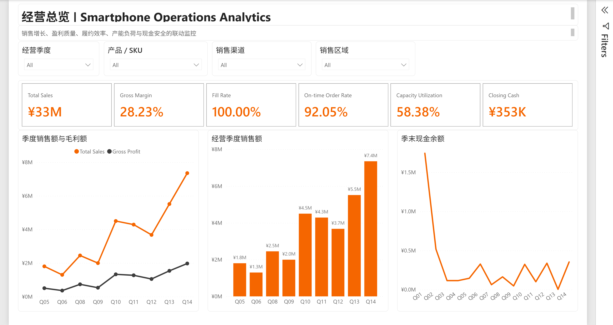
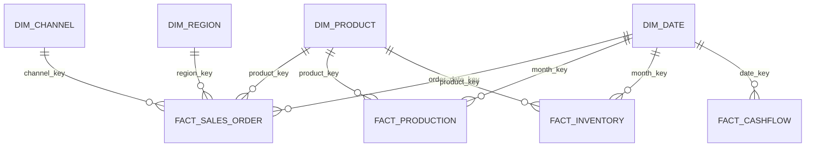
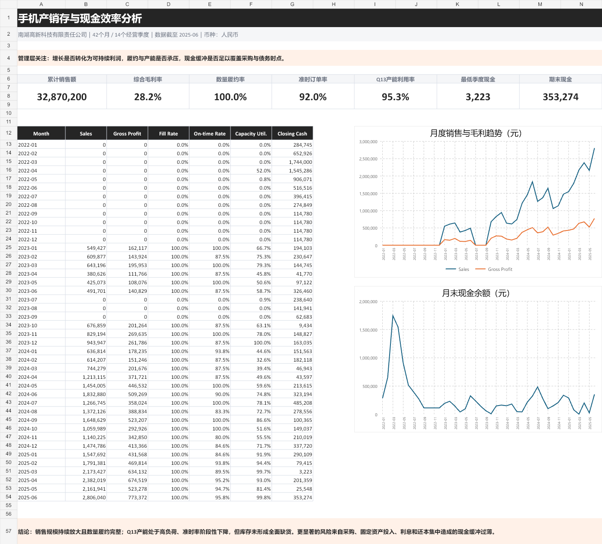
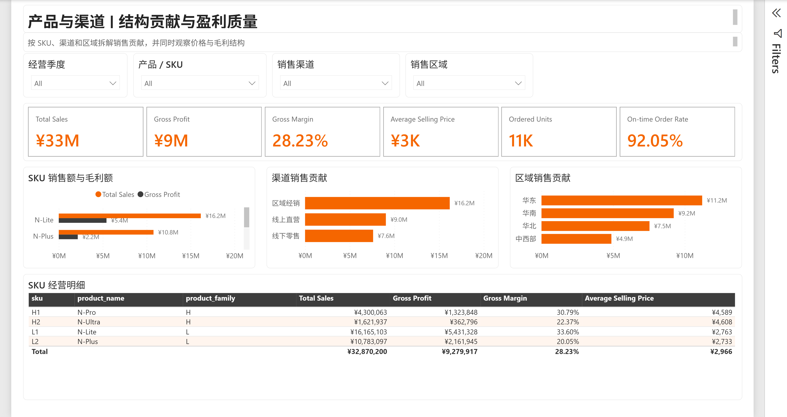
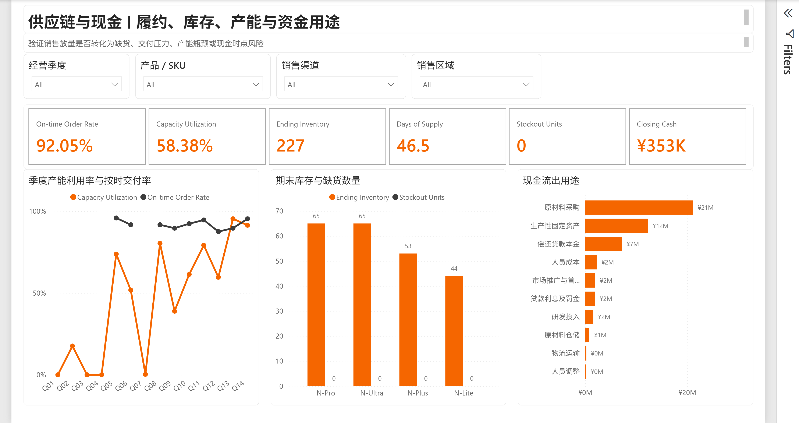

# Smartphone Operations Analytics

> 手机产销存与现金效率分析｜Excel + MySQL + Power BI 商业数据分析项目

[](LICENSE)
[](data/quality/qa_report.json)

本项目以专业见习模拟经营中“南湖高新科技有限责任公司”的 14 个经营季度为背景，将经营流水整理为连续 42 个月的手机生产、销售、库存、履约与现金数据，建立从原始业务表到 Excel 分析、MySQL 数据仓库和 Power BI 管理看板的完整分析链路。

项目尝试把经营记录转化为可对账的数据模型，定义清晰指标，用 SQL 和 Power BI 工具验证假设，并给出可以落地的经营建议。



## 1. 经营现状分析

- 销售放量真实存在。Q14 销售额为 735.00 万元，环比 Q13 增长 33.33%；Q13、Q14 加权产能利用率分别达到 95.33% 和 91.39%，说明生产弹性已经明显收窄。
- 履约压力存在，但不能简单归因于产能。全周期按时订单率为 92.05%，Q12、Q13 分别降至 87.50% 和 89.58%；但 Q14 在 91.39% 产能利用率下按时率回升至 95.31%，因此数据支持“高负荷是风险信号”，不支持“高负荷必然导致延期”的因果结论。
- 没有发现普遍缺货或仓储拥堵。数量履约率为 100%，累计缺货数量为 0；季度仓储占用率最高仅 27.69%。当前更合理的动作是优化 SKU 安全库存和周转，而不是新增仓库。
- 现金安全是最突出的经营脆弱点。Q13 期末现金仅 3,223 元，虽然 Q14 回升到 353,274 元，但相对经营规模仍然偏薄；原材料采购累计支出 21,158,400 元，占全部现金流出的 42.51%，采购节奏对现金安全影响最大。
- 产品和渠道集中度较高。L 产品家族贡献 81.98% 销售额；N-Lite 单一 SKU 贡献 49.18%，同时保持 33.60% 毛利率。区域经销贡献 49.29%，华东贡献 34.13%，增长依赖少数产品与渠道。

综上所述，本项目主要的经营问题为：

> 公司并未出现“仓库装不下、订单发不出”的资源错配，但现金流断裂和生产负荷问题已经十分突出，后期可能无法适应销售增长情况。管理重点应从扩仓转向滚动产销协同和采购付款节奏的适时调整。

## 2. 业务问题与分析假设

本项目主要回答以下五个问题：

1. 销售增长是否来自可持续的产品、渠道与区域组合？
2. 增长是否牺牲了价格、毛利率或交付质量？
3. 生产能力是否足以覆盖下一阶段增长？
4. 库存是在保障履约，还是形成低效资金占用？
5. 账面上“累计净现金为正”是否掩盖了阶段性的现金断点？

进行具体分析前建立四个假设：

| 假设 | 观察指标 | 判断结果 |
|---|---|---|
| H1：销售放量造成产能瓶颈 | 销售增速、产能利用率、加班/停机、按时率 | 部分支持：产能利用率连续高位，但 Q14 履约回升，不能直接判定因果 |
| H2：仓储和库存无法支撑增长 | 仓储占用率、库存覆盖天数、缺货量、数量履约率 | 不支持：无缺货、数量履约完整、仓储占用率较低 |
| H3：采购和投入节奏形成现金风险 | 净现金流、期末现金、支出结构、现金风险分层 | 支持：Q13 期末现金仅 3,223 元，采购是最大现金用途 |
| H4：销售结构过度集中 | SKU/产品家族/渠道/区域销售贡献与毛利 | 支持：L 家族、N-Lite 与区域经销贡献集中 |

## 3. 数据范围与对账控制

### 3.1 分析范围

- 时间范围：2022-01 至 2025-06，共 42 个月、14 个经营季度。
- 产品：4 个 SKU，分为 L/H 两个产品家族。
- 渠道：线上直营、线下零售、区域经销。
- 区域：华东、华南、华北、中西部。
- 事实数据：327 笔销售订单、168 条月度生产记录、168 条月度库存快照、237 笔现金流水。
- 生成方式：使用固定随机种子 `20260806` 补全订单日期、SKU、渠道、区域及履约明细；每次运行得到相同结果。

### 3.2 强制控制总额

细分数据必须回到专业见习经营流水的控制总额。任何明细补全都不能改变以下数字：

| 控制项 | 对账金额/结果 |
|---|---:|
| 销售回款总额 | 32,870,200 元 |
| L 产品家族回款 | 26,948,200 元 |
| H 产品家族回款 | 5,922,000 元 |
| 现金流入 | 50,130,681 元 |
| 现金流出 | 49,777,407 元 |
| 期末现金 | 353,274 元 |
| 逐季度现金勾稽 | 14/14 通过 |
| 库存恒等式 | 全部通过 |

每个经营季度均满足：

```text
期初现金 + 本季现金流入 - 本季现金流出 = 期末现金
期初库存 + 生产入库 - 发货数量 = 期末库存
```

自动质量检查结果见 [`qa_report.json`](data/quality/qa_report.json) 和 [`qa_checks.csv`](data/quality/qa_checks.csv)。

### 3.3 公开数据表

| 表 | 粒度 | 行数 | 主要字段 |
|---|---|---:|---|
| `dim_date` | 月 | 42 | 月份、经营季度、自然季度、月序号 |
| `dim_product` | SKU | 4 | 产品家族、定位、标价、标准成本 |
| `dim_channel` | 渠道 | 3 | 渠道名称、类型、价格系数 |
| `dim_region` | 区域 | 4 | 区域名称、层级 |
| `fact_sales_order` | 订单 | 327 | 数量、售价、折扣、成本、毛利、承诺/发货日期 |
| `fact_production` | 月 × SKU | 168 | 计划量、良品、不良品、分配产能、停机与加班 |
| `fact_inventory` | 月 × SKU | 168 | 期初、入库、需求、发货、期末、缺货、覆盖天数 |
| `fact_cashflow` | 现金交易 | 237 | 流入/流出、用途、金额、带符号金额 |

数据构建逻辑在 [`src/build_dataset.py`](src/build_dataset.py)，不依赖未公开的原始课程文件即可复现。

## 4. 数据模型

MySQL 数据库名为 `nanhu_mobile_analytics`，Power BI 采用 Import 模式与星型模型。



模型使用单向过滤，避免事实表之间的双向关系造成重复聚合。销售可以被季度、产品、渠道和区域切片；生产/库存可以被季度和产品切片；现金按季度和月份切片。渠道或区域筛选不会被错误地传导到未分摊的现金流水。

## 5. 指标口径

| 指标 | 口径 | 业务意义 |
|---|---|---|
| Total Sales | `SUM(net_sales)` | 扣除折扣后的订单净销售额 |
| Gross Margin | `Gross Profit / Total Sales` | 衡量增长质量，而非只看规模 |
| Fill Rate | `Shipped Units / Ordered Units` | 数量层面的订单满足程度 |
| On-time Order Rate | 按时订单数 / 全部订单数 | 是否在承诺日期内完成交付 |
| Capacity Utilization | 实际投产量 / 分配产能 | 生产弹性与过载风险 |
| Ending Inventory | 当前筛选末月的库存快照 | 避免把多个期末快照直接求和 |
| Days of Supply | 当前筛选末月 SKU 平均覆盖天数 | 库存能覆盖未来需求的时间 |
| Inventory Turnover | COGS / 月末库存金额平均值 | 库存占用效率 |
| Net Cashflow | 现金流入 - 现金流出 | 当期现金净变化 |
| Closing Cash | 从首月累计至当前月的 Net Cashflow | 经营过程中的真实现金缓冲 |

完整 DAX 定义见 [`powerbi/dax_measures.dax`](powerbi/dax_measures.dax)，TMDL 中每个指标均带有口径说明和格式字符串。

## 6. Excel 实现

成品：[`Smartphone_Operations_Analysis.xlsx`](excel/Smartphone_Operations_Analysis.xlsx)

工作簿共 19 个工作表：

- 面向阅读与决策：`经营看板`、`产品渠道`、`库存预警`、`现金流`、`情景测算`。
- 面向审计：`清洗映射`、`数据字典`、`月度KPI`、`季度KPI`、`质量检查`。
- 面向追溯：订单、库存、生产、现金明细，日期/产品/渠道/区域维表及质量检查源。



### 6.1 可审计公式

工作簿没有把关键结果粘贴成静态数字，主要汇总均可从单元格追溯到明细：

```excel
=XLOOKUP(ProductKey, 产品维表[product_key], 产品维表[product_name], "未映射")
=SUMIFS(订单明细[net_sales], 订单明细[product_name], 当前SKU)
=COUNTIFS(订单明细[channel_name], 当前渠道)
=IFERROR(GrossProfit / NetSales, 0)
```

具体实现包括：

- `XLOOKUP` 完成业务键到名称、产品家族和经营季度的映射，并用“未映射”暴露脏数据。
- `SUMIFS`/`COUNTIFS` 完成 SKU、渠道、区域、季度与现金用途的动态汇总。
- `IF`/`IFERROR` 完成零分母保护、状态分层和业务预警。
- 数据验证为库存季度和 Base/Growth/Stress 情景提供下拉选择。
- 条件格式突出高产能利用率、Critical 现金季度、库存异常与情景预警。
- 图表引用公式驱动的连续辅助区域，保证筛选或假设改变后可更新。

### 6.2 情景测算

`情景测算` 以 Q14 为基准，允许调整销量增长、ASP、单位成本、新增产能、安全现金底线和库存投入率。默认 Base 情景假设销量增长 10%、ASP 不变、单位成本下降 1%、新增月产能 120 台、安全现金底线 300,000 元。

默认结果为：销售额约 808.5 万元、毛利率约 27.55%、月均产能需求 980 台、可用月产能 1,100 台、预计期末现金 447,969 元。该情景表明产能可覆盖 Base 增长，但现金余量仍需要作为明确约束管理。

### 6.3 Excel 验证

- 关键控制总额在 `质量检查` 中重新计算，全部为 PASS。
- 公式错误扫描为 0。
- 所有主要工作表均完成渲染检查，确认没有空白图表、截断标题或不可读区域。
- 可视化截图保存在 `docs/`，构建预览和缓存不进入 Git。

## 7. MySQL 实现

SQL 文件按依赖顺序拆分
具体目录如下：

| 文件 | 作用 |
|---|---|
| [`00_create_database.sql`](sql/00_create_database.sql) | 创建 UTF-8 数据库 |
| [`01_create_tables.sql`](sql/01_create_tables.sql) | 建维表/事实表、主键、外键与 CHECK 约束 |
| [`02_load_data.sql`](sql/02_load_data.sql) | 从公开 CSV 批量导入 |
| [`03_create_views.sql`](sql/03_create_views.sql) | 建管理 KPI、销售结构、库存健康、履约和现金分析视图 |
| [`04_quality_checks.sql`](sql/04_quality_checks.sql) | 检查总额、行数、主键、库存恒等式和 14 季现金勾稽 |
| [`05_business_analysis.sql`](sql/05_business_analysis.sql) | CTE、窗口函数、LAG、排名和业务分层分析 |

核心视图：

- `vw_management_kpi_monthly`：42 行，月度管理指标。
- `vw_sales_mix`：产品 × 渠道 × 区域的销售结构。
- `vw_inventory_health`：月 × SKU 库存覆盖、缺货和状态。
- `vw_fulfillment_efficiency`：交付时效与履约表现。
- `vw_cashflow_analysis`：现金用途与累计余额。

代表性 SQL 模式：

```sql
WITH quarterly AS (...), cash AS (...)
SELECT q.*,
       (q.net_sales - LAG(q.net_sales) OVER (ORDER BY q.quarter_seq))
         / NULLIF(LAG(q.net_sales) OVER (ORDER BY q.quarter_seq), 0) AS sales_qoq_growth,
       c.closing_cash,
       CASE
         WHEN c.closing_cash < 100000 THEN 'Critical'
         WHEN c.closing_cash < 300000 THEN 'Watch'
         ELSE 'Stable'
       END AS cash_risk_band
FROM quarterly q
JOIN cash c USING (quarter_seq);
```

项目在 MySQL 8.0.46 中完成。

## 8. Power BI 实现

成品与源码：

- [`SmartphoneOperationsAnalytics.pbip`](powerbi/SmartphoneOperationsAnalytics.pbip)：可版本控制的项目入口。
- [`SmartphoneOperationsAnalytics.Report`](powerbi/SmartphoneOperationsAnalytics.Report)：PBIR 报表源码。
- [`SmartphoneOperationsAnalytics.SemanticModel`](powerbi/SmartphoneOperationsAnalytics.SemanticModel)：TMDL 星型模型、关系和 DAX。
- [`SmartphoneOperationsAnalytics.pbix`](powerbi/SmartphoneOperationsAnalytics.pbix)：经 Desktop 打开、刷新并保存的成品。
- [`SmartphoneOperationsAnalytics.pdf`](powerbi/SmartphoneOperationsAnalytics.pdf)：三页静态交付版。
- [`SmartphoneOperationsTheme-20260806.json`](powerbi/theme/SmartphoneOperationsTheme-20260806.json)：白、深灰、克制橙色主题。

PBIP/PBIR 适合源码管理，且项目文件可以由 Power BI Desktop 直接打开；由于该格式仍有预览特性，本仓库同时保留 PBIX 成品。参见 [Microsoft Power BI Project 文档](https://learn.microsoft.com/en-us/power-bi/developer/projects/projects-report)。

Power BI Desktop 使用 MySQL 原生连接器的 Import 模式。微软文档说明 Desktop 端需要 Oracle MySQL Connector/NET，且连接器支持 Import；数据库凭据只保存在本机 Power BI 凭据存储中，不写入 PBIP。参见 [Microsoft MySQL connector 文档](https://learn.microsoft.com/en-us/power-query/connectors/mysql-database)。

### 8.1 页面设计

1. `经营总览`：销售额、毛利率、履约率、库存周转、产能利用率和期末现金；配合经营季度销售/毛利、季度销售柱状图和季末现金趋势。
2. `产品与渠道`：SKU、渠道、区域贡献，以及产品层面的销售额、毛利额、毛利率和 ASP 明细。
3. `供应链与现金`：产能利用率与按时交付率联动、SKU 库存/缺货、现金流出用途。

四个切片器分别为经营季度、产品/SKU、销售渠道和销售区域。页面采用“标题与口径 → 筛选器 → KPI → 趋势/结构/诊断”的阅读顺序。





### 8.2 Power BI 报表的进一步检查

- Power BI、Excel、MySQL 的销售额、毛利率、履约率、产能利用率和现金余额相互对账。
- Authoring workflow 参考 [Microsoft Power BI authoring skill](https://github.com/microsoft/skills-for-fabric/blob/main/plugins/powerbi-authoring/skills/powerbi-report-authoring/SKILL.md)。

## 9. 关键业务发现

### 9.1 增长与盈利

- 全周期销售额 32,870,200 元，毛利率 28.23%。
- Q14 销售额 7,350,000 元，环比增长 33.33%，是全周期最高季度。
- N-Lite 贡献 16,165,103 元，占 49.18%，毛利率 33.60%；是规模和盈利兼具的核心 SKU。
- N-Plus 贡献 32.81% 销售额，但毛利率仅 20.05%，应优先拆解折扣、渠道返利和单位成本。

### 9.2 渠道与区域

- 区域经销占 49.29%，线上直营占 27.53%，线下零售占 23.18%。
- 华东占 34.13%，华南占 28.08%，华北占 22.94%，中西部占 14.85%。
- 渠道集中并非一定是问题，但会放大单一经销体系的议价、回款和需求波动风险。

### 9.3 履约、库存与产能

- 数量履约率 100%，累计缺货 0；没有证据支持“普遍缺货”。
- 按时订单率 92.05%，Q12 最低为 87.50%，交付时效仍需作为增长的质量护栏。
- Q13 和 Q14 产能利用率分别达到 95.33% 和 91.39%，超过 90% 后应触发加班、外协或排产调整评估。
- 季度仓储占用率最高 27.69%，当前新增仓库缺乏数据支持。

### 9.4 现金安全

- 现金流入 50,130,681 元，现金流出 49,777,407 元，期末现金 353,274 元。
- Q13 期末现金仅 3,223 元，是最危险的现金时点；仅看全周期净现金会漏掉该风险。
- 原材料采购占全部现金流出的 42.51%，生产性固定资产支出为 12,314,707 元。采购批次、供应商账期和资本开支节奏是现金改善的主要抓手。

## 10. 经营建议

1. 建立 12 周滚动 S&OP：以需求预测、在手订单、SKU 库存和可用产能联动排产；当产能利用率连续两月超过 90% 时，启动外协/加班评估，同时要求按时率不低于 92%。
2. 不优先扩仓：以 SKU 为单位设定安全库存和覆盖天数上下限，重点清理低需求 SKU 的冗余库存，把现金从“仓储面积”转向“结构优化”。
3. 建立 13 周现金预测：以 300,000 元为最低情景底线，按周管理采购付款、经销回款、贷款本息和资本开支；大型采购采用分批到货、分期付款或账期谈判。
4. 优化产品组合：保护 N-Lite 的高毛利与供给优先级；对 N-Plus 做价格—折扣—成本桥接，若毛利改善不能覆盖销量贡献，应缩减低效渠道投放。
5. 降低渠道单点依赖：把区域经销拆解到区域/经销商层级监控销售、按时率和回款周期，并逐步提升可直接观察终端需求的线上直营占比。

## 11. 如何复现

### 11.1 生成数据

Python 脚本只使用标准库：

```powershell
python src/build_dataset.py
```

生成结果写入 `data/processed/`，质量报告写入 `data/quality/`。

### 11.2 导入 MySQL 8.0

先创建本机加密登录路径，密码不会进入仓库或命令历史：

```powershell
mysql_config_editor set --login-path=smartphone_analytics `
  --host=127.0.0.1 --port=3306 --user=root --password
```

然后执行：

```powershell
powershell -ExecutionPolicy Bypass -File scripts/load_mysql.ps1

Get-Content -Raw sql/04_quality_checks.sql |
  mysql --login-path=smartphone_analytics --default-character-set=utf8mb4

Get-Content -Raw sql/05_business_analysis.sql |
  mysql --login-path=smartphone_analytics --default-character-set=utf8mb4
```

### 11.3 打开 Excel

直接打开 `excel/Smartphone_Operations_Analysis.xlsx`。工作簿保留全部公式、数据验证、条件格式与图表；源构建文件为 `src/build_excel.mjs`。

### 11.4 打开 Power BI

1. 安装 Power BI Desktop，并启用 PBIP/PBIR 预览功能。
2. 按微软要求安装 Oracle MySQL Connector/NET，安装后重启 Desktop。
3. 确保 `nanhu_mobile_analytics` 已导入本机 MySQL。
4. 打开 `powerbi/SmartphoneOperationsAnalytics.pbip`。
5. 在首次刷新时选择 Database authentication，输入本机 MySQL 用户名和密码；
6. 刷新模型并检查三页报表。

## 12. 仓库结构

```text
smartphone-operations-analytics/
├─ data/
│  ├─ processed/                 # 公开维表、事实表与 KPI mart
│  └─ quality/                   # 数据质量检查结果
├─ excel/
│  └─ Smartphone_Operations_Analysis.xlsx
├─ powerbi/
│  ├─ SmartphoneOperationsAnalytics.pbip
│  ├─ SmartphoneOperationsAnalytics.Report/
│  ├─ SmartphoneOperationsAnalytics.SemanticModel/
│  ├─ SmartphoneOperationsAnalytics.pbix
│  ├─ SmartphoneOperationsAnalytics.pdf
│  ├─ dax_measures.dax
│  └─ theme/
├─ sql/                          # 建库、导入、视图、QA 与业务分析
├─ src/                          # 数据、Excel、Power BI 可重复构建源码
├─ scripts/                      # MySQL 导入与项目验证脚本
├─ docs/                         # 截图、简历表述与面试讲解提纲
├─ outputs/                      # 分析摘要与交付副本
├─ LICENSE
└─ README.md
```


## License

[MIT License](LICENSE)
